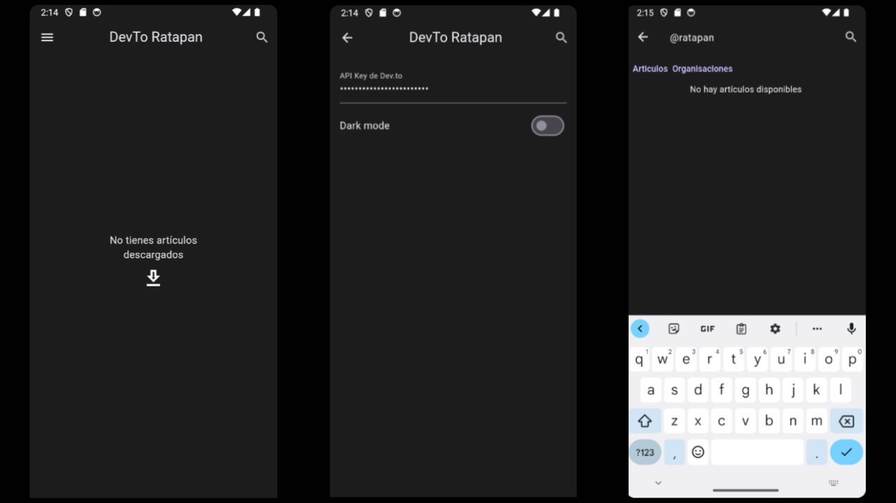
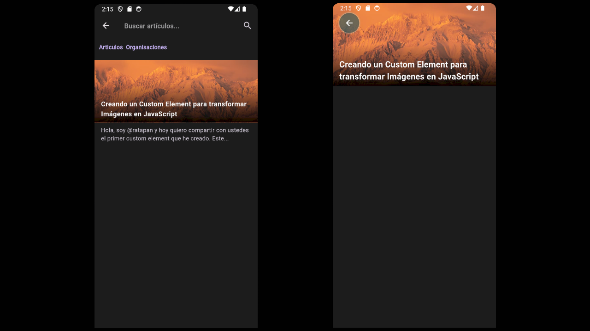

# Devto app

Un proyecto que atreves de la API de [dev.to](https://dev.to), se encargara de buscar y guardar artículos descargados. Con el fin de aprender a usar flutter.

### Home | Config |  Search

### Search | Article
